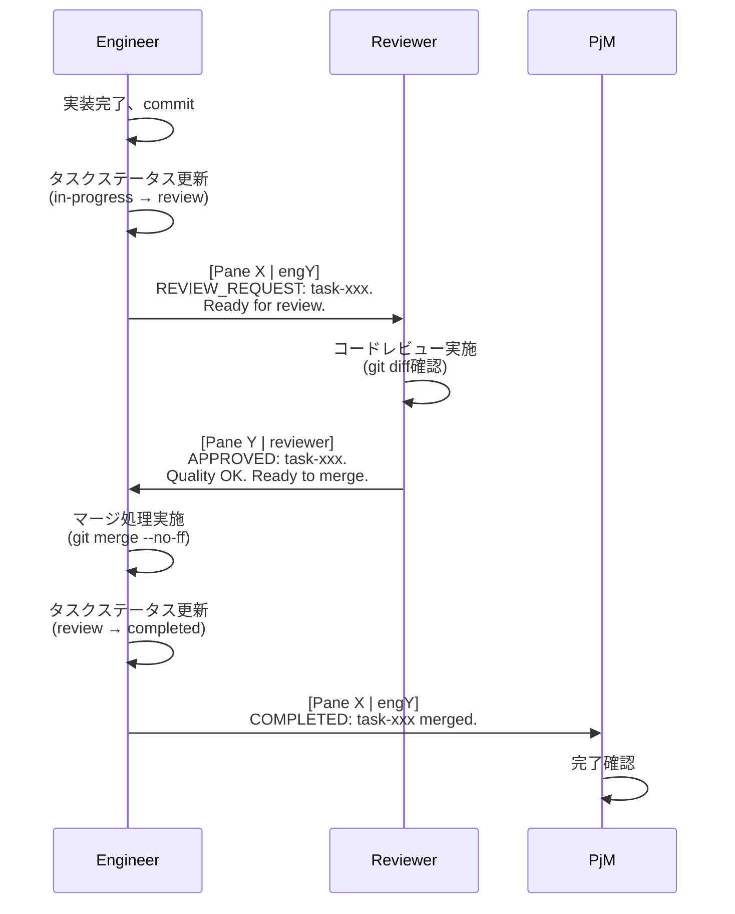
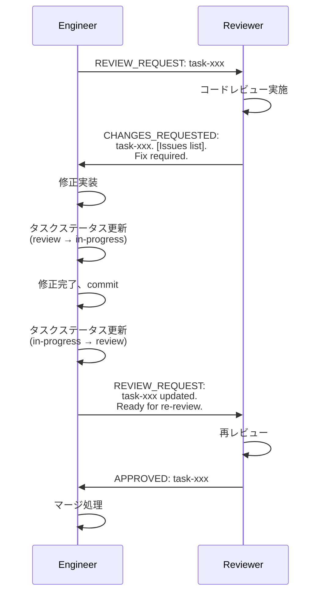
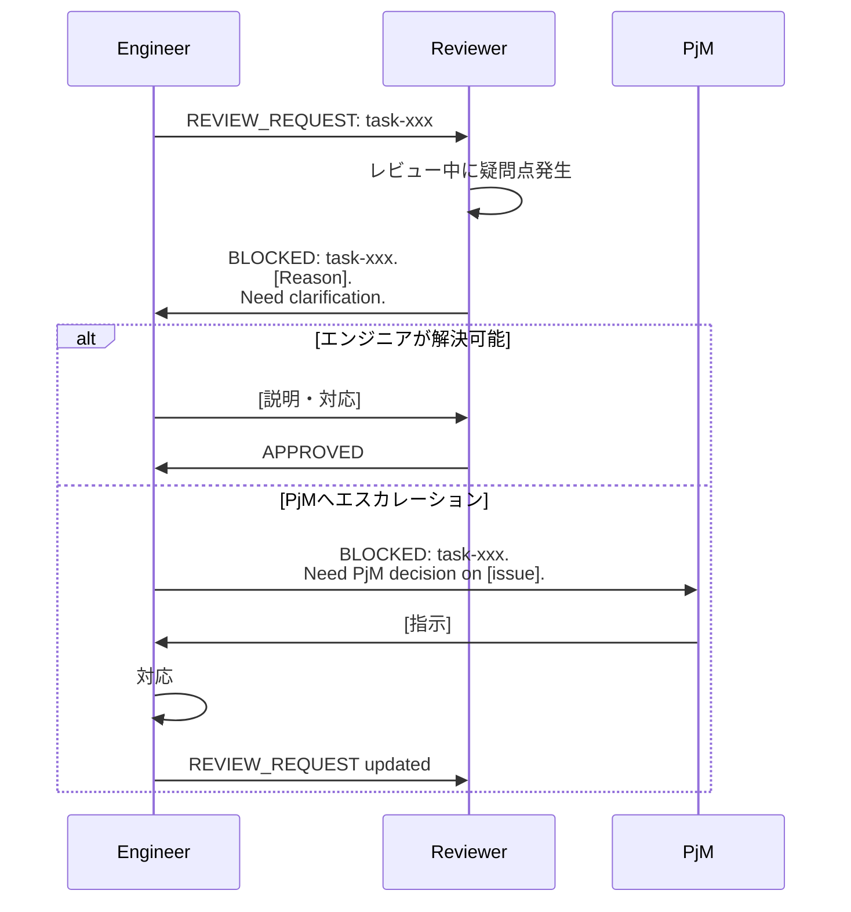

# 008: Phase 3 - Reviewer統合 詳細設計書

## 1. 概要

### 1.1 Phase 3の目的

Phase 3では、コードレビュープロセスをClaude Orchestratorシステムに統合し、品質保証レイヤーを追加する。Reviewerセッションを導入することで、エンジニアが実装したコードを自動的にレビューし、品質基準を満たしていることを確認する仕組みを構築する。

### 1.2 Phase 2からの進化

Phase 2では複数のエンジニア（eng1, eng2, ...）が並行して作業できる環境を構築した。Phase 3では、以下の点でさらに進化する：

- **品質保証の自動化**: Reviewerセッションによる体系的なコードレビュー
- **エンジニア自律型ワークフロー**: エンジニアが主導でレビュー依頼・マージを実施
- **直接コミュニケーション**: Engineer ↔ Reviewer間の直接やりとり（PjM介在なし）

### 1.3 達成目標

- ✅ Reviewerセッションの統合（tmuxペインとして起動）
- ✅ エンジニア主導のレビューワークフロー実装
- ✅ Engineer-Reviewer間のメッセージングプロトコル確立
- ✅ エンジニアによるマージ処理の実装
- ✅ `REVIEW_REQUIRED`設定による柔軟なレビューフロー制御

---

## 2. アーキテクチャ変更

### 2.1 セッション構造

Phase 3では、tmuxセッションに**Reviewerペイン**を追加する。

#### ペイン構成（3エンジニア + Reviewer の例）

```
┌─────────────────────────────────────────────────┐
│ Pane 0: PjM (Project Manager)                  │
├─────────────────────────────────────────────────┤
│ Pane 1: eng1 (Engineer 1)                      │
├─────────────────────────────────────────────────┤
│ Pane 2: eng2 (Engineer 2)                      │
├─────────────────────────────────────────────────┤
│ Pane 3: eng3 (Engineer 3)                      │
├─────────────────────────────────────────────────┤
│ Pane 4: reviewer (Code Reviewer)               │
└─────────────────────────────────────────────────┘
```

**ペイン番号の割り当て:**
- Pane 0: PjM（固定）
- Pane 1 〜 N: Engineers（動的、`--engineers N`で制御）
- Pane N+1: Reviewer（`--with-reviewer`で追加）

#### 作業ディレクトリ

| セッション | 作業ディレクトリ | コンテキスト |
|-----------|----------------|-------------|
| pjm | `sessions/pjm/` | オーケストレーター |
| eng1〜engN | `worktrees/eng1/`〜`worktrees/engN/` | ターゲットプロジェクト |
| reviewer | `sessions/reviewer/` | オーケストレーター（Engineer worktree に直接アクセス） |

### 2.2 Reviewerの作業環境

Reviewerはオーケストレーターコンテキスト（`sessions/reviewer/`）で動作し、Engineer の worktree に直接アクセスする。

**設計思想:**
- Reviewer は自身の worktree を持たない（シンプルさを優先）
- Engineer の worktree（`worktrees/eng1/`, `worktrees/eng2/`, ...）に直接 `cd` してレビュー
- これにより、追加の git worktree 管理やシンボリックリンクが不要

#### Reviewerのコードアクセス方法

```bash
# Reviewer の作業ディレクトリ
pwd
# → /path/to/claude-orchestrator/sessions/reviewer

# Engineer 1 の worktree に移動してレビュー
cd ../../worktrees/eng1
git diff main...HEAD
git log main..HEAD --oneline

# Engineer 2 の worktree をレビュー
cd ../eng2
git diff main...HEAD

# 元のディレクトリに戻る
cd ${ORCHESTRATOR_ROOT}/sessions/reviewer
```

#### クリーンアップ

システム停止時（`stop-system.sh`）に特別なクリーンアップは不要：
- Reviewer は worktree を持たない
- Engineer の worktree のみクリーンアップすればよい
- `sessions/reviewer/` ディレクトリは永続的に保持

### 2.3 タスクフロー

Phase 3では、タスクステータスに`review`が追加され、以下のフローで遷移する：

```
pending (queue/)
  ↓
in-progress (in-progress/)  ← エンジニアが実装中
  ↓
review (reviews/)           ← Reviewerがレビュー中
  ↓
completed (completed/)      ← レビュー承認後、エンジニアがマージ完了
```

**重要な特徴:**
- `REVIEW_REQUIRED=true`の場合、**必ず`review`ステータスを経由**
- `REVIEW_REQUIRED=false`の場合、`in-progress → completed`へ直接遷移可能
- ステータス更新はエンジニアが主導で実施

### 2.4 コミュニケーション構造

Phase 3の重要な特徴として、**Reviewerはエンジニアとのみ直接やりとりする**。PjMはレビュープロセスに介入しない。

```
     ┌─────────┐
     │   PjM   │
     └────┬────┘
          │
    タスク作成・完了確認のみ
          │
     ┌────▼────┐
     │ Engineer│◄─────────► │ Reviewer │
     └─────────┘  レビュー   └──────────┘
                  やりとり
```

**メッセージフロー:**
1. PjM → Engineer: タスク割り当て
2. **Engineer ↔ Reviewer**: レビュー依頼・フィードバック・承認
3. Engineer → PjM: 完了報告

---

## 3. レビューワークフロー詳細

### 3.1 基本フロー（承認パス）



#### ステップ詳細

**Step 1: エンジニアがレビュー依頼**
```bash
# エンジニアの作業（worktrees/eng1/）
git add .
git commit -m "Implement feature X"

# タスクステータス更新
../../scripts/core/task-manager.sh update task-xxx status review

# Reviewerへメッセージ送信
# （pane-manager経由で送信）
```

メッセージ例:
```
[Pane 1 | eng1] REVIEW_REQUEST: task-20251102-abc123. Implemented JWT authentication module. Ready for review.
```

**Step 2: Reviewerがレビュー実施**
```bash
# Reviewerの作業（sessions/reviewer/）
cd target-project
git fetch
git diff main...eng1/session-xxx

# コード品質チェック
# - 可読性、保守性
# - セキュリティ（SQLインジェクション、XSS等）
# - テストカバレッジ
# - ドキュメント
```

**Step 3: Reviewerが承認**

メッセージ例:
```
[Pane 4 | reviewer] APPROVED: task-20251102-abc123. Quality OK. Security checks passed. Ready to merge.
```

**Step 4: エンジニアがマージ処理**
```bash
# エンジニアの作業（worktrees/eng1/）
git checkout main
git pull
git merge --no-ff eng1/session-xxx -m "Merge: JWT authentication module"

# AUTO_PUSH_ENABLED=true の場合
git push origin main

# タスクステータス更新
../../scripts/core/task-manager.sh update task-xxx status completed
```

**Step 5: PjMへ完了報告**

メッセージ例:
```
[Pane 1 | eng1] COMPLETED: task-20251102-abc123 merged to main. JWT authentication module is now live.
```

### 3.2 修正依頼フロー



#### ステップ詳細

**Step 1: Reviewerが修正依頼**

メッセージ例:
```
[Pane 4 | reviewer] CHANGES_REQUESTED: task-20251102-abc123.
Issues:
1. SQL injection vulnerability in user_login() - use parameterized queries
2. Missing input validation for email field
3. Password hashing uses MD5 - upgrade to bcrypt
4. No unit tests for authentication flow
Fix required.
```

**Step 2: エンジニアが修正**
```bash
# タスクステータス巻き戻し（review → in-progress）
../../scripts/core/task-manager.sh update task-xxx status in-progress

# 修正実装
# ...

# 修正完了、commit
git add .
git commit -m "Fix security issues per review feedback"

# 再レビュー依頼
../../scripts/core/task-manager.sh update task-xxx status review
```

メッセージ例:
```
[Pane 1 | eng1] REVIEW_REQUEST: task-20251102-abc123 updated. Fixed all security issues. Added unit tests. Ready for re-review.
```

**Step 3: 承認後、マージ**

前述の「基本フロー」と同じ。

### 3.3 ブロッカーフロー

Reviewerが判断できない問題が発生した場合、BLOCKEDメッセージを送信する。



メッセージ例:
```
[Pane 4 | reviewer] BLOCKED: task-20251102-abc123.
Architectural concern: This implementation introduces tight coupling with external API.
Need clarification on whether we should introduce an abstraction layer.
```

エンジニアの対応:
1. 自分で判断できる → 説明または修正実装
2. 判断できない → PjMへエスカレーション

---

## 4. 実装計画

### 4.1 影響を受けるファイル

#### 既存ファイルの変更

| ファイル | 変更内容 |
|---------|---------|
| `scripts/start-system.sh` | `--with-reviewer`オプション追加、reviewerペイン作成処理 |
| `scripts/core/task-session.sh` | `create_reviewer_pane()`関数追加、レイアウト調整 |
| `scripts/core/pane-manager.sh` | reviewer用の作業ディレクトリ取得 |
| `scripts/core/task-manager.sh` | レビュー関連コマンド強化（既存機能で対応可能） |
| `sessions/engineer/init-prompt.txt` | レビュー依頼・マージ処理の手順追加 |

#### 新規ファイル

| ファイル | 内容 |
|---------|------|
| `sessions/reviewer/init.sh` | Reviewer初期化スクリプト（環境変数設定、Claude起動） |

#### 既存で利用可能

| ファイル | 内容 |
|---------|------|
| `sessions/reviewer/init-prompt.txt` | すでに存在（89行、レビュー観点など記載） |
| `tasks/reviews/` | すでに存在（reviewステータス用ディレクトリ） |

### 4.2 実装ステップ

#### Step 1: Reviewerセッション起動機能

**ファイル:** `scripts/start-system.sh`

**変更内容:**
- `--with-reviewer`オプション追加
- `ENABLE_REVIEWER`フラグ設定
- `create_reviewer_pane()`呼び出し

**実装例:**
```bash
# オプション解析
ENABLE_REVIEWER=false
while [[ $# -gt 0 ]]; do
    case $1 in
        --with-reviewer)
            ENABLE_REVIEWER=true
            shift
            ;;
        # ...
    esac
done

# Reviewerペイン作成
if [[ "$ENABLE_REVIEWER" == "true" ]]; then
    source "${SCRIPT_DIR}/core/task-session.sh"
    create_reviewer_pane "$task_id"
fi
```

#### Step 2: Reviewer用ディレクトリ確認

**ファイル:** `scripts/core/task-session.sh`

**新規関数:** `ensure_reviewer_directory()`

**実装例:**
```bash
ensure_reviewer_directory() {
    local reviewer_dir="${ORCHESTRATOR_ROOT}/sessions/reviewer"

    if [[ ! -d "$reviewer_dir" ]]; then
        log_info "Creating reviewer session directory: ${reviewer_dir}"
        mkdir -p "$reviewer_dir"
    fi

    log_debug "Reviewer directory ready: ${reviewer_dir}"
}
```

**設計思想:**
- Reviewer は worktree を作成せず、Engineer の worktree（`worktrees/eng1/`, `worktrees/eng2/`, ...）に直接アクセス
- シンボリックリンクや追加の git 管理は不要
- 最もシンプルなアーキテクチャ

**クリーンアップ:** 特別なクリーンアップ不要（`sessions/reviewer/` は永続的に保持）

#### Step 3: Engineer-Reviewer間メッセージングプロトコル実装

**ファイル:** `sessions/engineer/init-prompt.txt`

**追加内容:**

```markdown
## レビュー依頼プロセス（REVIEW_REQUIRED=trueの場合）

実装完了後、以下の手順でReviewerへレビュー依頼を行う：

1. 実装コードをcommit
2. タスクステータスを`review`に更新:
   ```bash
   ../../scripts/core/task-manager.sh update <task-id> status review
   ```

3. Reviewerへメッセージ送信（pane-manager経由）:
   ```
   [Pane X | engY] REVIEW_REQUEST: <task-id>. [Summary]. Ready for review.
   ```

4. Reviewerからの応答を待つ:
   - **APPROVED**: Step 5へ進む
   - **CHANGES_REQUESTED**: 修正実装後、Step 1へ戻る
   - **BLOCKED**: 質問に回答、または必要に応じてPjMへエスカレーション

5. 承認後、マージ処理:
   ```bash
   git checkout main
   git pull
   git merge --no-ff <your-branch>
   git push  # AUTO_PUSH_ENABLED=trueの場合
   ```

6. タスクステータスを`completed`に更新:
   ```bash
   ../../scripts/core/task-manager.sh update <task-id> status completed
   ```

7. PjMへ完了報告:
   ```
   [Pane X | engY] COMPLETED: <task-id> merged. [Summary].
   ```
```

**ファイル:** `sessions/reviewer/init-prompt.txt`（既存）

既存の内容をそのまま活用。必要に応じて以下を強調：

- Engineer **のみ**とやりとりする
- PjMへは報告しない
- マージ処理は**実施しない**（Engineerが実施）

#### Step 4: エンジニアによるマージ処理機能

エンジニアのinit-promptに手順を追加（Step 3で実施済み）。

追加の自動化は不要（エンジニアが手動でgit操作を実施）。

#### Step 5: Reviewerペイン作成関数

**ファイル:** `scripts/core/task-session.sh`

**新規関数:** `create_reviewer_pane()`

**実装例:**
```bash
create_reviewer_pane() {
    local task_id="$1"
    local session_name
    session_name=$(get_task_session_name "$task_id")
    local num_engineers="${NUM_ENGINEERS:-1}"

    log_info "Creating reviewer pane..."

    # Reviewer用ディレクトリを確認（worktreeは作成しない）
    ensure_reviewer_directory

    # Reviewerは最後のエンジニアペインの下に垂直分割で作成
    local last_engineer_pane="$num_engineers"
    tmux split-window -v -t "${session_name}.${last_engineer_pane}"

    # Reviewerペイン番号を計算（pjm=0, eng1...engN=1...N, reviewer=N+1）
    local reviewer_pane=$((num_engineers + 1))
    local reviewer_dir
    reviewer_dir=$(get_pane_workdir "reviewer")

    # 初期化スクリプトのパス
    local init_script="${ORCHESTRATOR_ROOT}/sessions/reviewer/init.sh"

    # 初期化スクリプトが存在する場合は実行
    if [[ -f "$init_script" ]]; then
        log_debug "Starting Claude in reviewer pane (auto-execution mode)..."
        tmux send-keys -t "${session_name}.${reviewer_pane}" "${init_script} '${task_id}' 'reviewer' '${reviewer_dir}' '${reviewer_pane}' '${ORCHESTRATOR_ROOT}'" C-m
    fi

    log_success "Reviewer pane created (pane ${reviewer_pane})"
}
```

#### Step 6: テストと検証

**Phase 1スタイル（No-Attach）テスト:**

```bash
# システム起動
./scripts/start-system.sh --engineers 2 --with-reviewer --instruction "ユーザー認証機能を実装してください"

# 60秒待機
sleep 60

# eng1の出力確認（レビュー依頼送信を確認）
./scripts/core/pane-manager.sh capture task-<task-id> 1 200 | grep "REVIEW_REQUEST"

# reviewerの出力確認（レビュー実施を確認）
./scripts/core/pane-manager.sh capture task-<task-id> 4 200 | grep -E "APPROVED|CHANGES_REQUESTED"

# eng1の出力確認（マージ処理を確認）
./scripts/core/pane-manager.sh capture task-<task-id> 1 300 | grep "git merge"

# システム停止
./scripts/stop-system.sh
```

**Phase 2スタイル（Attach）テスト:**

```bash
# システム起動（Terminal.appが自動で開く）
./scripts/start-system.sh --engineers 2 --with-reviewer --instruction "ユーザー認証機能を実装してください"

# tmuxセッションで以下を観察:
# - Pane 1-2 (Engineers): 実装 → レビュー依頼
# - Pane 4 (Reviewer): レビュー → 承認/修正依頼
# - Pane 1-2 (Engineers): マージ処理 → 完了報告
# - Pane 0 (PjM): 完了確認

# 手動でdetach: Ctrl+B, then D

# システム停止
./scripts/stop-system.sh
```

**成功基準:**
- ✅ Engineer-Reviewer間のメッセージが正しく配信される
- ✅ Reviewerがコードレビューを実施（git diff確認）
- ✅ エンジニアがマージ処理を完了
- ✅ タスクステータスが正しく遷移（in-progress → review → completed）
- ✅ PjMがレビュープロセスに介入しない

---

## 5. メッセージングプロトコル

### 5.1 Engineer → Reviewer

#### REVIEW_REQUEST（新規レビュー依頼）

**フォーマット:**
```
[Pane X | engY] REVIEW_REQUEST: <task-id>. <summary>. Ready for review.
```

**例:**
```
[Pane 1 | eng1] REVIEW_REQUEST: task-20251102-abc123. Implemented JWT authentication with bcrypt password hashing. Added unit tests. Ready for review.
```

#### REVIEW_REQUEST（再レビュー依頼）

**フォーマット:**
```
[Pane X | engY] REVIEW_REQUEST: <task-id> updated. <changes-summary>. Ready for re-review.
```

**例:**
```
[Pane 1 | eng1] REVIEW_REQUEST: task-20251102-abc123 updated. Fixed SQL injection vulnerability. Upgraded password hashing to bcrypt. Ready for re-review.
```

#### 質問・説明

**フォーマット:**
```
[Pane X | engY] <response-to-reviewer-question>
```

**例:**
```
[Pane 1 | eng1] Re: BLOCKED on abstraction layer - I've chosen to keep direct API calls for this MVP phase. We can refactor to abstraction layer in Phase 2 of the feature.
```

### 5.2 Reviewer → Engineer

#### APPROVED（承認）

**フォーマット:**
```
[Pane Y | reviewer] APPROVED: <task-id>. <approval-notes>. Ready to merge.
```

**例:**
```
[Pane 4 | reviewer] APPROVED: task-20251102-abc123. Code quality excellent. Security checks passed. Test coverage 95%. Ready to merge.
```

#### CHANGES_REQUESTED（修正依頼）

**フォーマット:**
```
[Pane Y | reviewer] CHANGES_REQUESTED: <task-id>.
Issues:
1. <issue-1>
2. <issue-2>
...
Fix required.
```

**例:**
```
[Pane 4 | reviewer] CHANGES_REQUESTED: task-20251102-abc123.
Issues:
1. SQL injection vulnerability in line 45 - use parameterized queries
2. Missing input validation for email field (lines 78-80)
3. Password hashing uses MD5 - upgrade to bcrypt
4. Test coverage only 60% - add tests for error cases
Fix required.
```

#### BLOCKED（ブロッカー）

**フォーマット:**
```
[Pane Y | reviewer] BLOCKED: <task-id>. <reason>. Need clarification.
```

**例:**
```
[Pane 4 | reviewer] BLOCKED: task-20251102-abc123.
Architectural concern: Direct database access from controller violates our layering principle.
Should we introduce a repository pattern here? Need clarification.
```

### 5.3 Engineer → PjM

#### COMPLETED（完了報告）

**フォーマット:**
```
[Pane X | engY] COMPLETED: <task-id> merged. <summary>.
```

**例:**
```
[Pane 1 | eng1] COMPLETED: task-20251102-abc123 merged to main. JWT authentication module is now live. Test coverage 95%.
```

#### BLOCKED（エスカレーション、必要時のみ）

**フォーマット:**
```
[Pane X | engY] BLOCKED: <task-id>. Need PjM decision on <issue>.
```

**例:**
```
[Pane 1 | eng1] BLOCKED: task-20251102-abc123. Reviewer raised architectural concern about repository pattern. Need PjM decision on whether to refactor now or defer to future sprint.
```

---

## 6. Git統合

### 6.1 レビュー前の準備（Engineer）

**エンジニアの作業:**

```bash
# 1. 実装完了、commit
git add .
git commit -m "Implement feature X per design doc"

# 2. オプション: ブランチをリモートにpush（チーム共有の場合）
git push origin eng1/session-xxx

# 3. タスクステータス更新
../../scripts/core/task-manager.sh update <task-id> status review

# 4. Reviewerへレビュー依頼メッセージ送信
```

### 6.2 レビュー中の操作（Reviewer）

**Reviewerの作業:**

```bash
# 1. Engineer 1 の worktree へ移動
cd ../../worktrees/eng1

# 2. 最新情報を取得
git fetch

# 3. 差分確認
git diff main...HEAD

# 4. 特定ファイルの確認
git show HEAD:src/auth/jwt.py

# 5. コミット履歴確認
git log main..HEAD --oneline

# 6. 変更ファイルリスト
git diff --name-only main...HEAD

# 7. レビュー完了後、元のディレクトリに戻る
cd ${ORCHESTRATOR_ROOT}/sessions/reviewer
```

**レビュー観点（`sessions/reviewer/init-prompt.txt`に記載）:**

1. **コード品質**
   - 可読性: 命名規則、コメント、構造
   - 保守性: 複雑度、重複コード
   - パフォーマンス: アルゴリズム効率、リソース使用
   - セキュリティ: SQLインジェクション、XSS、認証・認可

2. **設計**
   - アーキテクチャ整合性
   - SOLID原則の遵守
   - DRY原則の遵守

3. **テスト**
   - テストカバレッジ
   - エッジケースの考慮
   - テスト品質

4. **ドキュメント**
   - コード内コメント
   - README更新
   - APIドキュメント

### 6.3 承認後のマージ処理（Engineer）

**エンジニアの作業:**

```bash
# 1. mainブランチへ切り替え
git checkout main

# 2. 最新を取得
git pull origin main

# 3. マージ（--no-ff で必ずマージコミット作成）
git merge --no-ff eng1/session-xxx -m "Merge: Implement JWT authentication module

Reviewed-by: reviewer
Task-ID: task-20251102-abc123"

# 4. マージ結果確認
git log --oneline -5

# 5. プッシュ（AUTO_PUSH_ENABLED=trueの場合）
if [[ "${AUTO_PUSH_ENABLED}" == "true" ]]; then
    git push origin main
fi

# 6. タスクステータス更新
../../scripts/core/task-manager.sh update <task-id> status completed

# 7. PjMへ完了報告
```

**マージコンフリクト発生時:**

```bash
# コンフリクト発生
git merge --no-ff eng1/session-xxx
# Auto-merging src/auth/jwt.py
# CONFLICT (content): Merge conflict in src/auth/jwt.py

# オプション1: 自分で解決
git status
# ... 手動でコンフリクト解決 ...
git add src/auth/jwt.py
git commit

# オプション2: PjMへエスカレーション
# マージ中止
git merge --abort

# PjMへメッセージ送信
[Pane 1 | eng1] BLOCKED: task-xxx. Merge conflict with main branch in src/auth/jwt.py. Need coordination with other engineer.
```

### 6.4 修正依頼時の対応（Engineer）

**エンジニアの作業:**

```bash
# 1. タスクステータス巻き戻し
../../scripts/core/task-manager.sh update <task-id> status in-progress

# 2. 修正実装
git checkout eng1/session-xxx  # まだこのブランチにいるはず
# ... 修正実装 ...
git add .
git commit -m "Fix security issues per review feedback"

# 3. 再レビュー依頼
../../scripts/core/task-manager.sh update <task-id> status review

# 4. Reviewerへメッセージ送信
[Pane 1 | eng1] REVIEW_REQUEST: task-xxx updated. Fixed all issues. Ready for re-review.
```

---

## 7. 役割と責任

### 7.1 Engineer（エンジニア）

**責任:**
- 実装
- レビュー依頼（REVIEW_REQUESTメッセージ送信）
- **マージ処理**（承認後）
- タスクステータス管理（in-progress ↔ review → completed）
- PjMへの完了報告
- レビューコメントへの対応（修正または説明）

**やりとり相手:**
- Reviewer（レビュー依頼・フィードバック受信・質問対応）
- PjM（タスク受領・完了報告・エスカレーション）

**作業ディレクトリ:**
- `worktrees/engN/`（ターゲットプロジェクトコンテキスト）

**主要コマンド:**
```bash
# タスク確認
../../scripts/core/task-manager.sh my-tasks eng1

# レビュー依頼
../../scripts/core/task-manager.sh update <task-id> status review

# 完了
../../scripts/core/task-manager.sh update <task-id> status completed

# メッセージ送信（pane-manager経由）
```

### 7.2 Reviewer（コードレビュワー）

**責任:**
- コードレビュー実施
- フィードバック提供（APPROVED/CHANGES_REQUESTED/BLOCKED）
- 品質基準の維持
- セキュリティチェック

**やりとり相手:**
- **Engineerのみ**（直接やりとり）
- PjMとは**やりとりしない**

**作業ディレクトリ:**
- `sessions/reviewer/`（オーケストレーターコンテキスト）
- `../../worktrees/eng1/`, `../../worktrees/eng2/`, ... (Engineer worktree に直接アクセス)

**主要コマンド:**
```bash
# レビュー対象確認
../../scripts/core/task-manager.sh list review

# タスク詳細確認
../../scripts/core/task-manager.sh show <task-id>

# コメント追加
../../scripts/core/task-manager.sh comment <task-id> "<comment>" reviewer

# Git操作（target-project/経由）
cd target-project
git diff main...<branch>
git log main...<branch>
```

**重要な制約:**
- ✅ Engineerとのみメッセージをやりとり
- ❌ PjMへは報告しない
- ❌ マージ処理は実施しない（Engineerが実施）
- ❌ タスクステータスは変更しない（Engineerが管理）

### 7.3 PjM（プロジェクトマネージャー）

**責任:**
- タスク作成・割り当て
- 進捗モニタリング
- 完了確認
- エスカレーション対応（必要時）

**やりとり相手:**
- Engineer（タスク割り当て・完了報告受信・エスカレーション対応）

**Phase 3での変更:**
- ❌ レビュープロセスには**介入しない**
- ❌ Reviewerとは**直接やりとりしない**
- ✅ エンジニアからの完了報告を待つのみ

**作業ディレクトリ:**
- `sessions/pjm/`（オーケストレーターコンテキスト）

**主要コマンド:**
```bash
# タスク作成
../../scripts/core/task-manager.sh create feature "<description>" eng1 pjm

# 進捗確認
../../scripts/core/task-manager.sh list in-progress
../../scripts/core/task-manager.sh list review
../../scripts/core/task-manager.sh list completed

# タスク詳細
../../scripts/core/task-manager.sh show <task-id>
```

---

## 8. 設定とカスタマイズ

### 8.1 REVIEW_REQUIRED設定

**ファイル:** `config/target-project.conf`

```bash
# レビュー必須フラグ
REVIEW_REQUIRED=true  # または false
```

**動作:**

| 設定値 | 動作 |
|-------|------|
| `true` | すべてのタスクは必ず`review`ステータスを経由。Reviewerの承認なしに`completed`にできない。 |
| `false` | エンジニアが直接`in-progress → completed`へ遷移可能。Reviewerセッションは起動しない（`--with-reviewer`無効）。 |

**実装での考慮:**

`REVIEW_REQUIRED=true`の場合、エンジニアのinit-promptに以下を明記：

```markdown
## 重要: REVIEW_REQUIRED=true

このプロジェクトではコードレビューが必須です。実装完了後、**必ず**Reviewerへレビュー依頼を行ってください。

タスクを直接`completed`にすることはできません。必ず以下のフローに従ってください：

in-progress → review（Reviewerへ依頼） → completed（承認後、マージ）
```

### 8.2 AUTO_MERGE_ENABLED設定

**ファイル:** `config/target-project.conf`

```bash
# 自動マージの有効化（レビュー承認後）
AUTO_MERGE_ENABLED=false  # Phase 3では未使用（将来拡張用）
```

**Phase 3での扱い:**

Phase 3では、エンジニアが**手動でマージ処理**を実施する。`AUTO_MERGE_ENABLED`は将来の拡張用として残すが、現時点では使用しない。

**将来の拡張案（Phase 3.5以降）:**

`AUTO_MERGE_ENABLED=true`の場合、Reviewerの承認メッセージをトリガーに、システムが自動でマージ処理を実行：

```bash
# システム側（scripts/core/auto-merge.sh など）
if [[ "${AUTO_MERGE_ENABLED}" == "true" ]] && [[ "$reviewer_status" == "APPROVED" ]]; then
    # エンジニアのworktreeで自動マージ
    cd "worktrees/${assignee}/"
    git checkout main
    git merge --no-ff "${branch}"
    git push
fi
```

### 8.3 AUTO_PUSH_ENABLED設定

**ファイル:** `config/target-project.conf`

```bash
# 自動プッシュの有効化
AUTO_PUSH_ENABLED=false  # または true
```

**動作:**

| 設定値 | 動作 |
|-------|------|
| `true` | エンジニアがマージ後、自動的に`git push origin main`を実行。 |
| `false` | エンジニアが手動で`git push`を実行（またはpushしない）。 |

**エンジニアのinit-promptでの記載:**

```markdown
## マージ後のプッシュ

マージ完了後、以下を実行：

```bash
# AUTO_PUSH_ENABLED=trueの場合
git push origin main

# AUTO_PUSH_ENABLED=falseの場合
# プッシュは任意（チーム方針に従う）
```
```

### 8.4 レビュー観点のカスタマイズ

**ファイル:** `sessions/reviewer/init-prompt.txt`

レビュー観点をプロジェクトに合わせてカスタマイズ可能。

**デフォルト観点（既存）:**
1. コード品質（可読性、保守性、パフォーマンス、セキュリティ）
2. 設計（アーキテクチャ整合性、SOLID原則、DRY原則）
3. テスト（カバレッジ、エッジケース、品質）
4. ドキュメント（コメント、README、APIドキュメント）

**カスタマイズ例:**

特定のセキュリティ基準を強化：

```markdown
## セキュリティチェック（必須）

以下の項目を**必ず**確認すること：

1. **SQLインジェクション**: すべてのDB操作でパラメータ化クエリを使用
2. **XSS**: ユーザー入力の適切なエスケープ
3. **認証・認可**: 適切な権限チェック
4. **パスワード**: bcrypt/argon2によるハッシュ化（MD5/SHA1禁止）
5. **機密情報**: ハードコードされたAPIキー・パスワードの有無
6. **CSRF**: トークン検証の実装
```

特定のコーディング規約を追加：

```markdown
## コーディング規約チェック

1. **命名規則**: PEP 8準拠（Python）/ Airbnb Style Guide準拠（JavaScript）
2. **最大行長**: 100文字以内
3. **関数の複雑度**: Cyclomatic Complexity 10以下
4. **docstring**: すべてのpublic関数に必須
```

---

## 9. テスト計画

### 9.1 Phase 1スタイル（No-Attach）テスト

**目的:** 基本機能の自動検証

**手順:**

```bash
# システム起動
./scripts/start-system.sh --engineers 2 --with-reviewer \
    --instruction "ユーザー認証機能を実装してください：ユーザー登録、ログイン、パスワードリセットの3つのエンドポイントを作成してください"

# 60秒待機（実装開始）
sleep 60

# PjMの出力確認（タスク割り当て確認）
./scripts/core/pane-manager.sh capture task-<task-id> 0 200 | tail -100

# eng1の出力確認（実装中）
./scripts/core/pane-manager.sh capture task-<task-id> 1 300 | tail -150

# 180秒待機（実装完了、レビュー依頼）
sleep 180

# eng1のレビュー依頼メッセージ確認
./scripts/core/pane-manager.sh capture task-<task-id> 1 400 | grep "REVIEW_REQUEST"

# reviewerの出力確認（レビュー実施）
./scripts/core/pane-manager.sh capture task-<task-id> 4 200 | tail -100

# 120秒待機（レビュー完了）
sleep 120

# reviewerの承認/修正依頼メッセージ確認
./scripts/core/pane-manager.sh capture task-<task-id> 4 300 | grep -E "APPROVED|CHANGES_REQUESTED"

# eng1のマージ処理確認
./scripts/core/pane-manager.sh capture task-<task-id> 1 500 | grep "git merge"

# タスクステータス確認
./scripts/core/task-manager.sh show task-<task-id> | jq '.status'
# 期待値: "completed"

# システム停止
./scripts/stop-system.sh
```

**検証項目:**

- ✅ Reviewerペインが正しく作成される（Pane 4）
- ✅ Reviewer が Engineer worktree に直接アクセスできる
- ✅ Engineer → Reviewerへメッセージが配信される
- ✅ Reviewerがgit diffを実行してレビューを実施
- ✅ Reviewer → Engineerへ承認/修正依頼メッセージが配信される
- ✅ エンジニアがマージ処理を実施（`git merge --no-ff`）
- ✅ タスクステータスが正しく遷移（in-progress → review → completed）
- ✅ PjMがレビュープロセスに介入しない

### 9.2 Phase 2スタイル（Attach）テスト

**目的:** リアルタイムUX検証

**手順:**

```bash
# システム起動（Terminal.appが自動で開く）
./scripts/start-system.sh --engineers 2 --with-reviewer \
    --instruction "ユーザー認証機能を実装してください"

# tmuxセッション内で観察:
# - Pane 0 (PjM): タスク割り当て
# - Pane 1-2 (Engineers): 実装 → レビュー依頼
# - Pane 4 (Reviewer): レビュー → 承認/修正依頼
# - Pane 1-2 (Engineers): マージ処理 → 完了報告
# - Pane 0 (PjM): 完了確認

# 手動でdetach: Ctrl+B, then D

# システム停止
./scripts/stop-system.sh
```

**観察項目:**

- ✅ レイアウトが適切（5ペインが見やすく配置）
- ✅ メッセージフォーマット`[Pane X | role]`が見やすい
- ✅ Reviewerのレビューコメントが具体的で有用
- ✅ エンジニアがマージ処理をスムーズに実施
- ✅ PjMがレビュープロセスを傍観している（介入しない）
- ✅ 全体のコミュニケーションフローが自然

### 9.3 エンドツーエンドテスト

**目的:** 全フローの統合検証

**シナリオ1: 承認フロー**

```bash
# 1. システム起動
./scripts/start-system.sh --engineers 1 --with-reviewer \
    --instruction "簡単なHello World APIを実装してください"

# 2. エンジニアが実装完了、レビュー依頼
# （自動で進行）

# 3. Reviewerが承認
# （自動で進行）

# 4. エンジニアがマージ
# （自動で進行）

# 5. 検証
# タスクステータス確認
./scripts/core/task-manager.sh show task-<task-id> | jq '.status'
# 期待値: "completed"

# mainブランチにマージされたか確認
cd "${TARGET_PROJECT_PATH}"
git log --oneline -5 | grep "Merge:"
# 期待値: マージコミットが存在

# 6. クリーンアップ
./scripts/stop-system.sh
```

**シナリオ2: 修正依頼フロー**

```bash
# 1. システム起動
./scripts/start-system.sh --engineers 1 --with-reviewer \
    --instruction "セキュリティを考慮せずに簡単なログイン機能を実装してください（テスト用）"

# 2. エンジニアが実装完了、レビュー依頼
# （自動で進行）

# 3. Reviewerが修正依頼（セキュリティ問題を指摘）
# （自動で進行）

# 4. エンジニアが修正、再レビュー依頼
# （自動で進行）

# 5. Reviewerが承認
# （自動で進行）

# 6. エンジニアがマージ
# （自動で進行）

# 7. 検証
# タスクヒストリー確認
./scripts/core/task-manager.sh show task-<task-id> | jq '.history'
# 期待値: review → in-progress → review → completed の遷移履歴

# レビューコメント確認
./scripts/core/task-manager.sh show task-<task-id> | jq '.review_notes'
# 期待値: Reviewerのコメントが記録されている

# 8. クリーンアップ
./scripts/stop-system.sh
```

**シナリオ3: ブロッカーフロー**

```bash
# 1. システム起動
./scripts/start-system.sh --engineers 1 --with-reviewer \
    --instruction "データベースアクセスレイヤーを実装してください（アーキテクチャ判断が必要）"

# 2. エンジニアが実装完了、レビュー依頼
# （自動で進行）

# 3. Reviewerがブロッカー発行（アーキテクチャ判断必要）
# （自動で進行）

# 4. エンジニアがPjMへエスカレーション
# （自動で進行）

# 5. PjMが指示
# （自動で進行）

# 6. エンジニアが対応、再レビュー依頼
# （自動で進行）

# 7. Reviewerが承認
# （自動で進行）

# 8. エンジニアがマージ
# （自動で進行）

# 9. 検証
# メッセージログ確認
./scripts/core/pane-manager.sh capture task-<task-id> 0 500 | grep "BLOCKED"
# 期待値: PjMがBLOCKEDメッセージを受信している

# 10. クリーンアップ
./scripts/stop-system.sh
```

### 9.4 成功基準

**機能面:**
- ✅ Reviewerセッションが正常に起動
- ✅ Reviewer が Engineer worktree に正常にアクセスできる
- ✅ Engineer-Reviewer間のメッセージが100%配信される
- ✅ Reviewerがコードレビューを実施（git diff確認）
- ✅ エンジニアがマージ処理を完了
- ✅ タスクステータスが正しく遷移
- ✅ `REVIEW_REQUIRED`設定が正しく機能

**UX面:**
- ✅ レイアウトが見やすい
- ✅ メッセージフォーマットが明確
- ✅ レビューコメントが具体的
- ✅ マージ処理がスムーズ
- ✅ PjMがレビュープロセスに介入しない

**品質面:**
- ✅ エラーログなし
- ✅ タスクファイルの破損なし
- ✅ git操作の失敗なし
- ✅ デッドロック・競合なし

---

## 10. リスクと対策

### 10.1 想定リスク

#### リスク1: Engineer worktree へのアクセス

**問題:**
- Engineer の worktree がまだ作成されていない
- Reviewer が誤った worktree パスにアクセス
- 相対パスの解決が正しく動作しない

**対策:**
- Reviewer init-prompt に Engineer worktree の明示的なパス記載
- `ensure_reviewer_directory()` でディレクトリの事前確認
- `ORCHESTRATOR_ROOT` 環境変数の正しい設定
- エラーハンドリング（worktree が存在しない場合の対応）

**設計メリット:**
- シンボリックリンク不要でシンプル
- Engineer と同じアーキテクチャパターン（一貫性）
- クリーンアップ不要（worktree は Engineer が所有）
- トラブルシューティングが容易

#### リスク2: マージコンフリクト

**問題:**
- 複数エンジニアが同じファイルを編集
- マージ時にコンフリクト発生
- エンジニアがコンフリクト解決に慣れていない

**対策:**
- エンジニアのinit-promptにコンフリクト対応手順を明記
- コンフリクト発生時はPjMへエスカレーション可能に
- PjMが他のエンジニアと調整

**init-promptへの追記:**
```markdown
## マージコンフリクト対応

マージ時にコンフリクトが発生した場合：

**オプション1: 自分で解決（推奨）**
```bash
git merge --no-ff <branch>
# CONFLICT発生
git status
# ... 手動でコンフリクト解決 ...
git add <resolved-files>
git commit -m "Merge: <description> (resolved conflicts)"
```

**オプション2: PjMへエスカレーション**
```bash
git merge --abort
# PjMへメッセージ
[Pane X | engY] BLOCKED: task-xxx. Merge conflict in <files>. Need coordination with other engineer.
```
```

#### リスク3: Reviewerのコンテキスト肥大化

**問題:**
- Reviewerが多数のタスクをレビュー
- コンテキストが95%に到達
- レビュー品質が低下

**対策:**
- レビュー完了後、`/clear`でコンテキストリセット
- init-promptを再送信して役割を再認識
- 重要な情報はタスクファイルに記録（コンテキストに依存しない）

**init-promptへの追記:**
```markdown
## コンテキスト管理

レビュー件数が増えてコンテキストが肥大化した場合：

1. `/clear`でコンテキストをリセット
2. 以下のコマンドで役割を再認識:
   ```bash
   cat init-prompt.txt
   ```
3. レビュー対象を確認:
   ```bash
   ../../scripts/core/task-manager.sh list review
   ```
```

#### リスク4: レビュー遅延

**問題:**
- Reviewerがレビューを開始しない
- エンジニアがブロックされる

**対策:**
- エンジニアがReviewerへリマインド可能に
- PjMがレビュー遅延を検知してエスカレーション
- タイムアウト設定（将来拡張）

**エンジニアのリマインド例:**
```
[Pane 1 | eng1] REMINDER: task-xxx. Waiting for review since 30 minutes ago. Please prioritize.
```

#### リスク5: REVIEW_REQUIRED設定の不整合

**問題:**
- `REVIEW_REQUIRED=true`だがReviewerセッションが起動していない
- エンジニアがレビュープロセスをスキップ

**対策:**
- `start-system.sh`で設定チェック:
  - `REVIEW_REQUIRED=true`かつ`--with-reviewer`なし → 警告表示
- エンジニアのinit-promptで設定値を明示
- タスクステータス遷移バリデーション（`task-manager.sh`）

**実装例:**
```bash
# start-system.sh
if [[ "${REVIEW_REQUIRED}" == "true" ]] && [[ "${ENABLE_REVIEWER}" != "true" ]]; then
    log_warn "REVIEW_REQUIRED=true but --with-reviewer not specified."
    log_warn "Review process will not work correctly."
    log_warn "Consider adding --with-reviewer option."
fi
```

---

## 11. Phase 4への準備

Phase 3の実装により、Phase 4（Docs Writer統合）の基盤が整う。

### 11.1 Phase 3で構築される基盤

- ✅ **ペイン動的追加機能**: `create_reviewer_pane()`と同様に`create_docs_pane()`を実装可能
- ✅ **役割ベースメッセージング**: Engineer ↔ Reviewer パターンを Docs Writer にも適用可能
- ✅ **タスクフロー拡張**: `review`ステータスと同様に`docs`ステータス追加可能
- ✅ **シンボリックリンク方式**: Docs Writerも同じパターンでターゲットプロジェクトにアクセス可能

### 11.2 Phase 4で追加する要素

**Docs Writerの役割:**
- システムドキュメントの要約
- READMEの自動更新
- API仕様書の生成
- チュートリアルの作成

**ワークフロー案:**
1. タスク完了後、Docs Writerがドキュメント更新
2. PjMまたはReviewerがドキュメントレビュー
3. 承認後、ドキュメントをコミット

**実装パターン（Phase 3と同様）:**
- `--with-docs`オプション追加
- `create_docs_pane()`関数
- `sessions/docs/init-prompt.txt`利用
- Engineer worktree へ直接アクセス（Reviewer と同じパターン）

---

## 12. 参考情報

### 12.1 関連ドキュメント

- `docs/000-design-doc-v0.1.x.md` - Phase 3の概要設計
- `docs/000-detailed-design-v0.1.0.md` - Phase 3以降の拡張計画
- `docs/007-phase2-progress-summary.md` - Phase 2の成果と次のステップ
- `CLAUDE.md` - 開発ワークフロー、コマンドリファレンス

### 12.2 実装スケジュール

**Phase 3実装:**
- Step 1-2: Reviewerセッション起動機能（2-3時間）
- Step 3-4: メッセージング統合（2-3時間）
- Step 5: Git統合・マージ処理（2-3時間）
- Step 6: テスト・検証（3-4時間）
- **合計**: 9-13時間（Phase 2と同程度）

**優先順位:**
1. 高: Reviewerペイン作成、ディレクトリ確認
2. 高: Engineer-Reviewerメッセージング
3. 中: マージ処理フロー
4. 中: テスト・検証
5. 低: AUTO_MERGE_ENABLED拡張（Phase 3.5以降）

### 12.3 次のステップ

Phase 3詳細設計書作成完了後、以下の順で実装を進める：

1. **実装準備**
   - 既存コードのバックアップ
   - 実装ブランチ作成（`feature/phase3-reviewer-integration`）

2. **実装（このドキュメントに従って）**
   - Step 1: Reviewerセッション起動機能
   - Step 2: Reviewer用ディレクトリ確認
   - Step 3-4: メッセージング統合
   - Step 5: Git統合
   - Step 6: テスト

3. **レビュー・マージ**
   - Phase 1スタイルテスト実施
   - Phase 2スタイルテスト実施
   - エンドツーエンドテスト実施
   - masterへマージ

4. **ドキュメント更新**
   - `CLAUDE.md`にPhase 3コマンド追記
   - READMEの更新（必要に応じて）

---

**Phase 3詳細設計書 - 完成** 🎉✨
