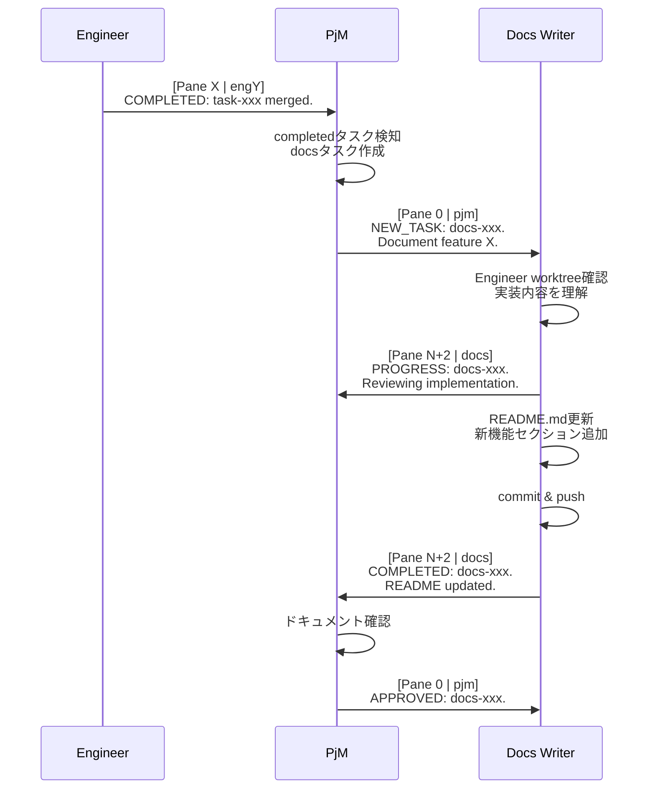
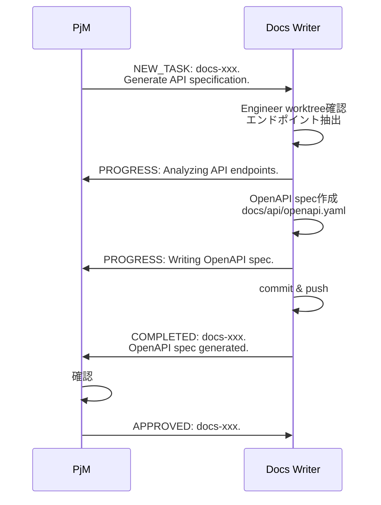
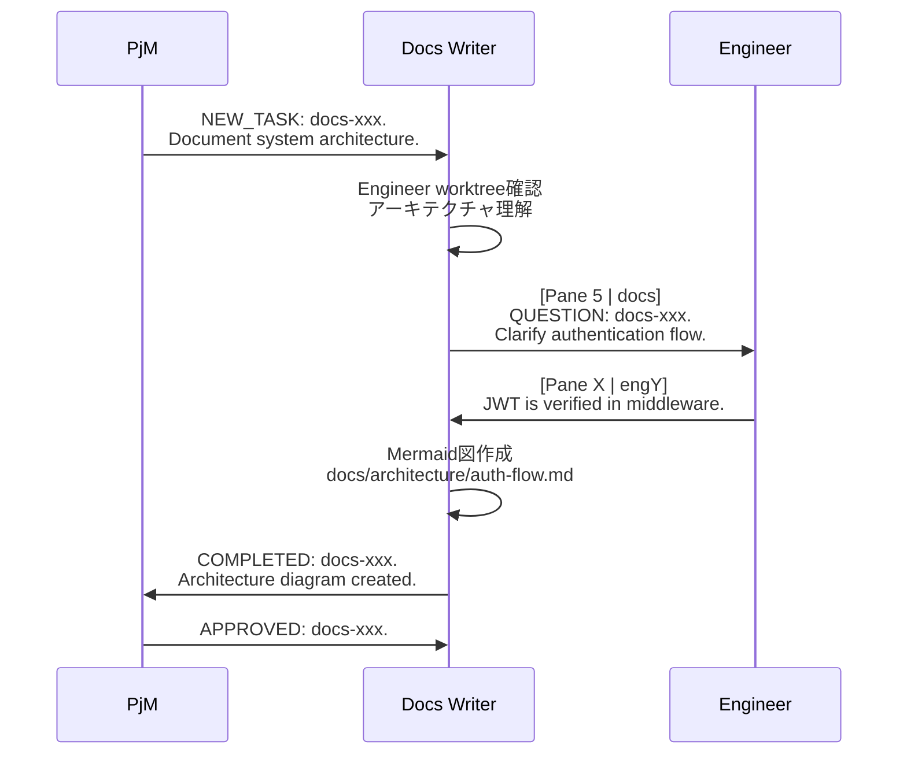
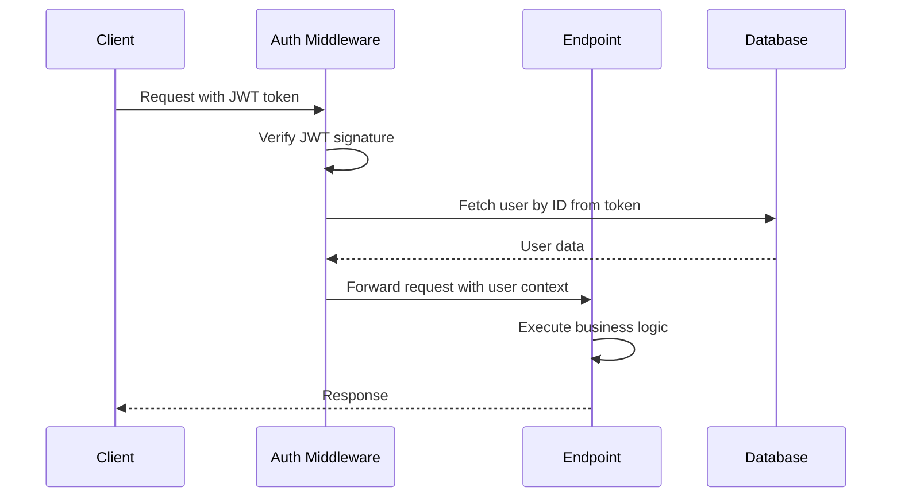
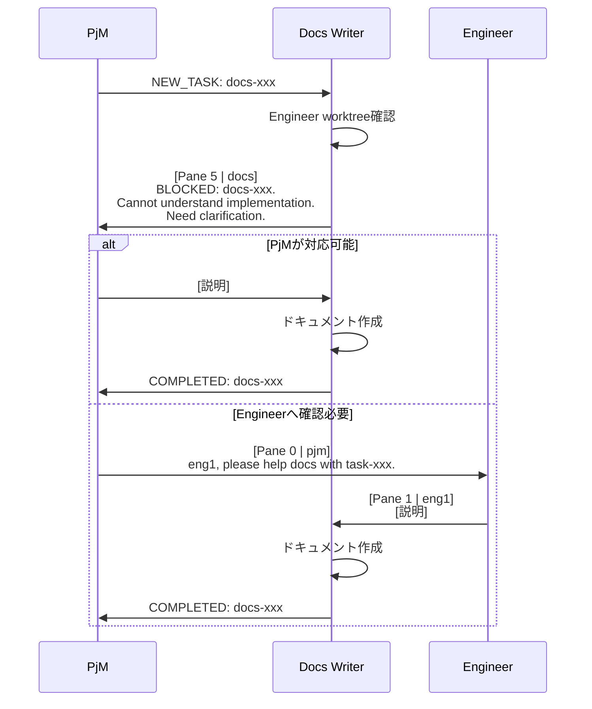

# 009: Phase 4 - Documentation Writer統合 詳細設計書

## 1. 概要

### 1.1 Phase 4の目的

Phase 4では、ドキュメント生成プロセスをClaude Orchestratorシステムに統合し、実装完了後の技術ドキュメント作成を自動化する。Documentation Writerセッションを導入することで、完了したタスクを元に技術仕様書、API Doc、アーキテクチャ図などを自動生成する仕組みを構築する。

### 1.2 Phase 3からの進化

Phase 3ではReviewerセッションによる品質保証レイヤーを構築した。Phase 4では、以下の点でさらに進化する:

- **ドキュメント生成の自動化**: Documentation Writerセッションによる体系的なドキュメント作成
- **Technical Writerペルソナ**: 正確で読みやすい技術文書作成
- **オンデマンド起動**: `--with-docs`オプションによる柔軟な運用
- **PjMレビュー**: 軽量なレビュープロセスによる品質担保

### 1.3 達成目標

- ✅ Documentation Writerセッションの統合(tmuxペインとして起動)
- ✅ オプション起動方式の実装(`--with-docs`フラグ)
- ✅ completedタスクトリガーによる自動ドキュメント生成
- ✅ API Doc、Architecture、I/F仕様など技術文書の生成
- ✅ PjM-Docs Writer間のメッセージングプロトコル確立
- ✅ Technical Writerペルソナの実装

---

## 2. アーキテクチャ変更

### 2.1 セッション構造

Phase 4では、tmuxセッションに**Documentation Writerペイン**を追加する。

#### ペイン構成(3エンジニア + Reviewer + Docs Writer の例)

```
┌─────────────────────────────────────────────────┐
│ Pane 0: PjM (Project Manager)                  │
├─────────────────────────────────────────────────┤
│ Pane 1: eng1 (Engineer 1)                      │
├─────────────────────────────────────────────────┤
│ Pane 2: eng2 (Engineer 2)                      │
├─────────────────────────────────────────────────┤
│ Pane 3: eng3 (Engineer 3)                      │
├─────────────────────────────────────────────────┤
│ Pane 4: reviewer (Code Reviewer)               │
├─────────────────────────────────────────────────┤
│ Pane 5: docs (Documentation Writer)            │
└─────────────────────────────────────────────────┘
```

**ペイン番号の割り当て:**
- Pane 0: PjM(固定)
- Pane 1 〜 N: Engineers(動的、`--engineers N`で制御)
- Pane N+1: Reviewer(`--with-reviewer`で追加)
- Pane N+2: Documentation Writer(`--with-docs`で追加)

#### 作業ディレクトリ

| セッション | 作業ディレクトリ | コンテキスト |
|-----------|----------------|-------------|
| pjm | `sessions/pjm/` | オーケストレーター |
| eng1〜engN | `TARGET_PROJECT_PATH/.orchestrator-worktrees/eng1/`〜`engN/` | ターゲットプロジェクト |
| reviewer | `sessions/reviewer/` | オーケストレーター(Engineer worktree に直接アクセス) |
| docs | `sessions/docs/` | オーケストレーター(Engineer worktree + TARGET_PROJECT_PATH に直接アクセス) |

### 2.2 Documentation Writerの作業環境

Documentation Writerはオーケストレーターコンテキスト(`sessions/docs/`)で動作し、Engineer の worktree とターゲットプロジェクトに直接アクセスする。

**設計思想:**
- Docs Writer は自身の worktree を持たない(Reviewerパターン踏襲)
- Engineer の worktree(`TARGET_PROJECT_PATH/.orchestrator-worktrees/eng1/`, `eng2/`, ...)に直接 `cd` してコード確認
- ターゲットプロジェクト(`TARGET_PROJECT_PATH/`)のドキュメントディレクトリに直接書き込み
- これにより、追加の git worktree 管理やシンボリックリンクが不要

#### Docs Writerのアクセス方法

```bash
# Docs Writer の作業ディレクトリ
pwd
# → /path/to/claude-orchestrator/sessions/docs

# Engineer 1 の worktree に移動してコード確認
cd ${TARGET_PROJECT_PATH}/.orchestrator-worktrees/eng1
cat src/api/endpoints.py
git log main..HEAD --oneline

# ターゲットプロジェクトのドキュメントディレクトリへ移動
cd ${TARGET_PROJECT_PATH}/docs
vim api-specification.md

# 元のディレクトリに戻る
cd ${ORCHESTRATOR_ROOT}/sessions/docs
```

#### クリーンアップ

システム停止時(`stop-system.sh`)に特別なクリーンアップは不要:
- Docs Writer は worktree を持たない
- Engineer の worktree のみクリーンアップすればよい
- `sessions/docs/` ディレクトリは永続的に保持

### 2.3 タスクフロー

Phase 4では、`completed`タスクをトリガーにドキュメント生成タスク(type=docs)が作成される:

```
pending (queue/)
  ↓
in-progress (in-progress/)  ← エンジニアが実装中
  ↓
review (reviews/)           ← Reviewerがレビュー中
  ↓
completed (completed/)      ← レビュー承認後、エンジニアがマージ完了
  ↓
[PjMがdocsタスク作成]       ← completedを検知して自動作成
  ↓
in-progress (in-progress/)  ← Docs Writerがドキュメント生成中
  ↓
completed (completed/)      ← PjM承認後、完了
```

**重要な特徴:**
- `DOCS_ENABLED=true`かつ`--with-docs`の場合、completedタスクをトリガーにdocsタスクを自動作成
- docsタスクは通常のタスクフローに従う(`in-progress → completed`)
- 既存のタスクステータスディレクトリをそのまま使用(新規ステータス不要)

### 2.4 コミュニケーション構造

Phase 4の重要な特徴として、**Docs WriterはPjMとのみ直接やりとりする**。Engineerへの質問は最小限に抑える。

```
     ┌─────────┐
     │   PjM   │◄─────────► │  Docs   │
     └────┬────┘   タスク    └─────────┘
          │         管理
    タスク作成・完了確認
          │
     ┌────▼────┐
     │ Engineer│
     └─────────┘
```

**メッセージフロー:**
1. PjM → Docs Writer: タスク割り当て(docsタスク)
2. Docs Writer → PjM: 進捗報告、質問、完了報告
3. **Docs Writer → Engineer**: 実装詳細の確認(必要時のみ、最小限)

---

## 3. ドキュメント生成ワークフロー詳細

### 3.1 基本フロー(README.md更新)



#### ステップ詳細

**Step 1: PjMがcompletedタスクを検知**
```bash
# PjMの作業(sessions/pjm/)
# completedタスクを検知(自動)
../../scripts/core/task-manager.sh list completed

# docsタスクを作成
../../scripts/core/task-manager.sh create docs "Document JWT authentication module (task-xxx)" docs pjm
```

メッセージ例:
```
[Pane 0 | pjm] NEW_TASK: docs-20251103-abc123. Document JWT authentication module (task-20251102-abc123). See eng1 worktree.
```

**Step 2: Docs WriterがEngineer worktreeを確認**
```bash
# Docs Writerの作業(sessions/docs/)
cd ${TARGET_PROJECT_PATH}/.orchestrator-worktrees/eng1

# 実装されたコード確認
git diff main...HEAD
git log main..HEAD --oneline

# 設計ドキュメント確認
cat design-doc-xxx.md
```

メッセージ例:
```
[Pane 5 | docs] PROGRESS: docs-20251103-abc123. Reviewing JWT implementation in eng1 worktree. Analyzing endpoints and authentication flow.
```

**Step 3: README.md更新**
```bash
# ターゲットプロジェクトのREADME編集
cd ${TARGET_PROJECT_PATH}
vim README.md

# 変更をcommit
git add README.md
git commit -m "docs: Add JWT authentication section to README

- Added authentication overview
- Documented /auth/register, /auth/login, /auth/reset endpoints
- Added usage examples

Task-ID: docs-20251103-abc123
Original-Task: task-20251102-abc123"

# push(AUTO_PUSH_ENABLED=trueの場合)
git push origin main
```

**Step 4: PjMへ完了報告**

メッセージ例:
```
[Pane 5 | docs] COMPLETED: docs-20251103-abc123. Updated README.md with JWT authentication section. Added API endpoints documentation and usage examples.
```

**Step 5: PjMが承認**

メッセージ例:
```
[Pane 0 | pjm] APPROVED: docs-20251103-abc123. Documentation looks good. Clear and concise.
```

### 3.2 API Doc生成フロー



#### ステップ詳細

**Step 1: エンドポイント抽出**
```bash
# Engineer worktree確認
cd ${TARGET_PROJECT_PATH}/.orchestrator-worktrees/eng1

# Pythonの場合: エンドポイント定義を確認
grep -r "@app.route" src/
grep -r "@router" src/

# Node.jsの場合: ルート定義を確認
grep -r "app.get\|app.post\|app.put\|app.delete" src/
```

**Step 2: OpenAPI spec作成**
```yaml
# docs/api/openapi.yaml
openapi: 3.0.0
info:
  title: User Authentication API
  version: 1.0.0
paths:
  /auth/register:
    post:
      summary: Register new user
      requestBody:
        required: true
        content:
          application/json:
            schema:
              type: object
              properties:
                email:
                  type: string
                password:
                  type: string
      responses:
        '201':
          description: User created successfully
```

**Step 3: commit & push**
```bash
cd ${TARGET_PROJECT_PATH}
git add docs/api/openapi.yaml
git commit -m "docs: Add OpenAPI specification for authentication API

Task-ID: docs-xxx"
git push origin main
```

### 3.3 Architecture Doc生成フロー



#### ステップ詳細

**Step 1: アーキテクチャ理解**
```bash
# Engineer worktree確認
cd ${TARGET_PROJECT_PATH}/.orchestrator-worktrees/eng1

# ディレクトリ構造確認
tree src/ -L 3

# 主要ファイル確認
cat src/auth/middleware.py
cat src/auth/jwt.py
```

**Step 2: 必要に応じてEngineerへ質問**

メッセージ例:
```
[Pane 5 | docs] QUESTION: docs-20251103-abc123. Could you clarify where JWT token verification happens? Is it in middleware or in each endpoint?
```

Engineerの回答例:
```
[Pane 1 | eng1] JWT verification happens in auth_middleware.py (line 45). It's applied globally to all /api/* routes. Each endpoint just accesses request.user after verification.
```

**Step 3: Mermaid図作成**
```markdown
# docs/architecture/auth-flow.md

# Authentication Flow

## JWT Authentication Sequence



## Component Overview

- **Auth Middleware**: Verifies JWT token on every request
- **JWT Service**: Issues and validates tokens
- **User Repository**: User data access layer
```

**Step 4: commit & push**
```bash
cd ${TARGET_PROJECT_PATH}
git add docs/architecture/auth-flow.md
git commit -m "docs: Add authentication flow architecture diagram

Task-ID: docs-xxx"
git push origin main
```

### 3.4 ブロッカーフロー

Docs Writerが実装内容を理解できない場合、BLOCKEDメッセージを送信する。



メッセージ例:
```
[Pane 5 | docs] BLOCKED: docs-20251103-abc123.
Implementation is complex and I cannot determine the authentication flow from code alone.
Files:
- src/auth/middleware.py (150 lines)
- src/auth/jwt.py (200 lines)
- src/auth/handlers.py (300 lines)
Need clarification on high-level authentication flow before documenting.
```

PjMの対応:
1. 自分で説明できる → Docs Writerへ説明
2. Engineerへ確認必要 → Engineerへ依頼

---

## 4. 実装計画

### 4.1 影響を受けるファイル

#### 既存ファイルの変更

| ファイル | 変更内容 |
|---------|---------|
| `scripts/start-system.sh` | `--with-docs`オプション追加、docsペイン作成処理 |
| `scripts/core/task-session.sh` | `ensure_docs_directory()`関数追加、`create_docs_pane()`関数追加 |
| `scripts/core/pane-manager.sh` | docs用の作業ディレクトリ取得(既存機能で対応可能) |
| `sessions/pjm/init-prompt-v0.2.0.txt` | completedタスク検知時にdocsタスク作成ロジック追加 |
| `config/target-project.conf` | `DOCS_ENABLED`設定追加 |

#### 新規ファイル

| ファイル | 内容 |
|---------|------|
| `sessions/docs/init.sh` | Docs Writer初期化スクリプト(環境変数設定、Claude起動) |
| `sessions/docs/init-prompt-v0.4.0.txt` | Docs Writer用プロンプト(Technical Writerペルソナ) |

#### 既存で利用可能

| ファイル | 内容 |
|---------|------|
| `scripts/core/task-manager.sh` | TYPE_DOCS="docs"が既に定義済み(line 26) |
| `tasks/queue/`, `tasks/in-progress/`, `tasks/completed/` | docsタスクも同じディレクトリ使用 |

### 4.2 実装ステップ

#### Step 1: Documentation Writerセッション基盤構築

**ファイル:** `sessions/docs/init.sh`

**実装内容:**
```bash
#!/usr/bin/env bash
set -euo pipefail

TASK_ID="${1:-}"
ROLE="${2:-docs}"
WORK_DIR="${3:-}"
PANE_ID="${4:-}"
ORCHESTRATOR_ROOT="${5:-}"

# 環境変数設定
export TASK_ID
export ROLE
export WORK_DIR
export PANE_ID
export ORCHESTRATOR_ROOT
export TARGET_PROJECT_PATH
export TARGET_PROJECT_MAIN_BRANCH
export NUM_ENGINEERS
export DOCS_ENABLED

# init-promptをenvsubstで変換してClaude起動
envsubst < "${ORCHESTRATOR_ROOT}/sessions/docs/init-prompt-v0.4.0.txt" | \
    claude --dangerously-skip-permissions
```

**ファイル:** `sessions/docs/init-prompt-v0.4.0.txt`

**実装内容:**
- Technical Writerペルソナ設定
- API Doc、Architecture、I/F仕様重視
- PjMへの進捗報告・完了報告フロー
- Engineerへの質問プロトコル(最小限)
- ドキュメント生成観点(正確性、読みやすさ、完全性)

#### Step 2: ペイン管理機能拡張

**ファイル:** `scripts/core/task-session.sh`

**新規関数1:** `ensure_docs_directory()`
```bash
ensure_docs_directory() {
    local docs_dir="${ORCHESTRATOR_ROOT}/sessions/docs"

    if [[ ! -d "$docs_dir" ]]; then
        log_info "Creating docs session directory: ${docs_dir}"
        mkdir -p "$docs_dir"
    fi

    log_debug "Docs directory ready: ${docs_dir}"
}
```

**新規関数2:** `create_docs_pane()`
```bash
create_docs_pane() {
    local task_id="$1"
    local session_name
    session_name=$(get_task_session_name "$task_id")
    local num_engineers="${NUM_ENGINEERS:-1}"
    local enable_reviewer="${ENABLE_REVIEWER:-false}"

    log_info "Creating docs pane..."

    # Docs Writer用ディレクトリを確認(worktreeは作成しない)
    ensure_docs_directory

    # Docs Writerは最後のペインの下に垂直分割で作成
    if [[ "$enable_reviewer" == "true" ]]; then
        # Reviewerペインの下に作成
        local reviewer_pane=$((num_engineers + 1))
        tmux split-window -v -t "${session_name}.${reviewer_pane}"
    else
        # 最後のエンジニアペインの下に作成
        local last_engineer_pane="$num_engineers"
        tmux split-window -v -t "${session_name}.${last_engineer_pane}"
    fi

    # Docsペイン番号を計算
    # reviewer有: pjm=0, eng1...engN=1...N, reviewer=N+1, docs=N+2
    # reviewer無: pjm=0, eng1...engN=1...N, docs=N+1
    local docs_pane
    if [[ "$enable_reviewer" == "true" ]]; then
        docs_pane=$((num_engineers + 2))
    else
        docs_pane=$((num_engineers + 1))
    fi

    local docs_dir
    docs_dir=$(get_pane_workdir "docs")

    # 初期化スクリプトのパス
    local init_script="${ORCHESTRATOR_ROOT}/sessions/docs/init.sh"

    # 初期化スクリプトが存在する場合は実行
    if [[ -f "$init_script" ]]; then
        log_debug "Starting Claude in docs pane (auto-execution mode)..."
        tmux send-keys -t "${session_name}.${docs_pane}" \
            "${init_script} '${task_id}' 'docs' '${docs_dir}' '${docs_pane}' '${ORCHESTRATOR_ROOT}'" C-m
    fi

    log_success "Docs pane created (pane ${docs_pane})"
}
```

#### Step 3: start-system.shへのオプション追加

**ファイル:** `scripts/start-system.sh`

**変更内容:**
```bash
# オプション解析
ENABLE_DOCS=false
while [[ $# -gt 0 ]]; do
    case $1 in
        --with-docs)
            ENABLE_DOCS=true
            shift
            ;;
        # ...
    esac
done

# Docsペイン作成
if [[ "$ENABLE_DOCS" == "true" ]]; then
    source "${SCRIPT_DIR}/core/task-session.sh"
    create_docs_pane "$task_id"
fi

# ヘルプメッセージ更新
    --with-docs              Enable documentation writer pane (requires DOCS_ENABLED=true in config)
```

#### Step 4: configファイル更新

**ファイル:** `config/target-project.conf`

**追加内容:**
```bash
# Phase 4: Documentation Writer
# ドキュメント生成機能の有効化
DOCS_ENABLED=false  # または true

# ドキュメント生成対象(カンマ区切り)
# オプション: readme, changelog, api, architecture, guide
DOCS_TARGETS="api,architecture"

# ドキュメント自動コミットの有効化
DOCS_AUTO_COMMIT=true  # または false
```

#### Step 5: PjM init-prompt更新

**ファイル:** `sessions/pjm/init-prompt-v0.2.0.txt` (または新バージョン作成)

**追加内容:**
```markdown
## Documentation Writer統合(Phase 4)

### docsタスクの自動作成

DOCS_ENABLED=trueかつ--with-docsでシステム起動している場合、completedタスクを検知したら自動的にdocsタスクを作成してください。

**タイミング:**
- Engineer がタスクをcompletedに更新した直後
- 実装内容が十分にドキュメント化の価値がある場合(判断基準: 新機能追加、API変更、アーキテクチャ変更)

**docsタスク作成コマンド:**
```bash
../../scripts/core/task-manager.sh create docs "Document <feature-name> (original task: <task-id>)" docs pjm
```

**メッセージ送信:**
```
[Pane 0 | pjm] NEW_TASK: docs-xxx. Document <feature-name> (original task: <task-id>). See eng<N> worktree for implementation details.
```

### Docs Writerとのやりとり

**受信メッセージ:**
- `PROGRESS`: ドキュメント作成中の進捗報告
- `COMPLETED`: ドキュメント作成完了
- `BLOCKED`: 実装内容を理解できず、質問が必要
- `QUESTION`: 実装詳細の確認

**送信メッセージ:**
- タスク割り当て: `NEW_TASK`
- 承認: `APPROVED`
- 質問への回答
- Engineerへの協力依頼(BLOCKED時)

### ドキュメント確認

Docs Writerから完了報告を受けたら、以下を確認:
1. TARGET_PROJECT_PATH/docs/ 配下のドキュメントファイルを確認
2. 内容が正確で読みやすいか簡易チェック(詳細レビュー不要)
3. 問題なければ`APPROVED`メッセージを送信

**承認メッセージ例:**
```
[Pane 0 | pjm] APPROVED: docs-xxx. Documentation looks good.
```
```

#### Step 6: テストと検証

**Phase 1スタイル(No-Attach)テスト:**

```bash
# システム起動
./scripts/start-system.sh --engineers 2 --with-reviewer --with-docs \
    --instruction "簡単なHello World APIを実装してください"

# 60秒待機(実装開始)
sleep 60

# 180秒待機(実装完了、レビュー、マージ)
sleep 180

# completedタスク確認
./scripts/core/task-manager.sh list completed

# docsタスクが作成されたか確認
./scripts/core/task-manager.sh list in-progress | grep "docs-"

# Docs Writerの出力確認
./scripts/core/pane-manager.sh capture task-<task-id> 5 200 | tail -100

# 120秒待機(ドキュメント生成)
sleep 120

# Docs Writerの完了メッセージ確認
./scripts/core/pane-manager.sh capture task-<task-id> 5 300 | grep "COMPLETED"

# ドキュメントファイル確認
ls -la ${TARGET_PROJECT_PATH}/docs/

# システム停止
./scripts/stop-system.sh
```

**Phase 2スタイル(Attach)テスト:**

```bash
# システム起動(Terminal.appが自動で開く)
./scripts/start-system.sh --engineers 2 --with-reviewer --with-docs \
    --instruction "ユーザー認証機能を実装してください"

# tmuxセッション内で観察:
# - Pane 0 (PjM): タスク割り当て → completed検知 → docsタスク作成
# - Pane 1-2 (Engineers): 実装 → レビュー依頼 → マージ → 完了報告
# - Pane 4 (Reviewer): レビュー → 承認
# - Pane 5 (Docs Writer): Engineer worktree確認 → ドキュメント作成 → 完了報告
# - Pane 0 (PjM): ドキュメント確認 → 承認

# 手動でdetach: Ctrl+B, then D

# システム停止
./scripts/stop-system.sh
```

---

## 5. メッセージングプロトコル

### 5.1 Docs Writer → PjM

#### PROGRESS(進捗報告)

**フォーマット:**
```
[Pane N+2 | docs] PROGRESS: <task-id>. <progress-detail>.
```

**例:**
```
[Pane 5 | docs] PROGRESS: docs-20251103-abc123. Reviewing JWT implementation in eng1 worktree. Analyzing endpoints and authentication flow.
```

#### COMPLETED(完了報告)

**フォーマット:**
```
[Pane N+2 | docs] COMPLETED: <task-id>. <completion-summary>.
```

**例:**
```
[Pane 5 | docs] COMPLETED: docs-20251103-abc123. Generated OpenAPI specification for authentication API. Added endpoint documentation with request/response examples.
```

#### QUESTION(質問)

**フォーマット:**
```
[Pane N+2 | docs] QUESTION: <task-id>. <question>.
```

**例:**
```
[Pane 5 | docs] QUESTION: docs-20251103-abc123. Should I document the internal token refresh logic, or only the public API endpoints?
```

#### BLOCKED(ブロッカー)

**フォーマット:**
```
[Pane N+2 | docs] BLOCKED: <task-id>. <reason>. Need clarification.
```

**例:**
```
[Pane 5 | docs] BLOCKED: docs-20251103-abc123.
Implementation is complex and I cannot determine the authentication flow from code alone.
Files analyzed:
- src/auth/middleware.py (150 lines)
- src/auth/jwt.py (200 lines)
- src/auth/handlers.py (300 lines)
Need high-level explanation of authentication flow before documenting.
```

### 5.2 PjM → Docs Writer

#### NEW_TASK(タスク割り当て)

**フォーマット:**
```
[Pane 0 | pjm] NEW_TASK: <docs-task-id>. Document <feature-name> (original task: <task-id>). See eng<N> worktree.
```

**例:**
```
[Pane 0 | pjm] NEW_TASK: docs-20251103-abc123. Document JWT authentication module (original task: task-20251102-xyz789). See eng1 worktree for implementation.
```

#### APPROVED(承認)

**フォーマット:**
```
[Pane 0 | pjm] APPROVED: <docs-task-id>. <approval-notes>.
```

**例:**
```
[Pane 0 | pjm] APPROVED: docs-20251103-abc123. Documentation is clear and complete. API examples are helpful.
```

#### 質問への回答

**フォーマット:**
```
[Pane 0 | pjm] <answer-to-question>
```

**例:**
```
[Pane 0 | pjm] Re: docs-xxx question - Document only public API endpoints. Internal token refresh is implementation detail.
```

#### Engineerへの協力依頼(BLOCKED時)

**フォーマット:**
```
[Pane 0 | pjm] @eng<N>, please help docs writer with task <docs-task-id>. <request>.
```

**例:**
```
[Pane 0 | pjm] @eng1, please help docs writer with task docs-20251103-abc123. Provide high-level overview of authentication flow.
```

### 5.3 Docs Writer ↔ Engineer(必要時のみ)

#### QUESTION(Docs → Engineer)

**フォーマット:**
```
[Pane N+2 | docs] QUESTION: <docs-task-id>. @eng<N>, <question>.
```

**例:**
```
[Pane 5 | docs] QUESTION: docs-20251103-abc123. @eng1, could you clarify where JWT token verification happens? Is it in middleware or in each endpoint?
```

#### 回答(Engineer → Docs)

**フォーマット:**
```
[Pane X | eng<N>] Re: <docs-task-id> - <answer>.
```

**例:**
```
[Pane 1 | eng1] Re: docs-20251103-abc123 - JWT verification happens in auth_middleware.py (line 45). It's applied globally to all /api/* routes.
```

---

## 6. Git統合

### 6.1 ドキュメント生成の実施(Docs Writer)

**Docs Writerの作業:**

```bash
# 1. Engineer worktree確認(読み取り専用)
cd ${TARGET_PROJECT_PATH}/.orchestrator-worktrees/eng1
git diff main...HEAD
git log main..HEAD --oneline

# 2. ターゲットプロジェクトへ移動
cd ${TARGET_PROJECT_PATH}

# 3. ドキュメントファイル作成・編集
vim docs/api/authentication.md

# 4. 変更をcommit
git add docs/api/authentication.md
git commit -m "docs: Add authentication API documentation

- Documented /auth/register, /auth/login, /auth/reset endpoints
- Added request/response examples
- Included authentication flow diagram

Task-ID: docs-20251103-abc123
Original-Task: task-20251102-xyz789"

# 5. push(AUTO_PUSH_ENABLED=trueの場合)
if [[ "${AUTO_PUSH_ENABLED}" == "true" ]]; then
    git push origin main
fi

# 6. 元のディレクトリに戻る
cd ${ORCHESTRATOR_ROOT}/sessions/docs
```

### 6.2 ドキュメントディレクトリ構造

**推奨構造:**

```
TARGET_PROJECT_PATH/
├── README.md                     # プロジェクト概要(更新対象)
├── CHANGELOG.md                  # 変更履歴(更新対象)
├── docs/
│   ├── api/                      # API仕様書
│   │   ├── openapi.yaml         # OpenAPI specification
│   │   ├── authentication.md    # 認証API
│   │   └── users.md             # ユーザーAPI
│   ├── architecture/             # アーキテクチャドキュメント
│   │   ├── overview.md          # システム概要
│   │   ├── auth-flow.md         # 認証フロー(Mermaid図)
│   │   └── database-schema.md   # DBスキーマ
│   ├── guides/                   # チュートリアル
│   │   ├── quickstart.md        # クイックスタート
│   │   └── authentication.md    # 認証ガイド
│   └── design/                   # Design Doc(Engineerが作成)
│       └── design-doc-xxx.md
```

### 6.3 コミットメッセージ規約

**フォーマット:**
```
docs: <summary>

- <detail-1>
- <detail-2>
- <detail-3>

Task-ID: <docs-task-id>
Original-Task: <original-task-id>
```

**例:**
```
docs: Add JWT authentication API documentation

- Documented /auth/register, /auth/login, /auth/reset endpoints
- Added request/response examples with curl commands
- Included authentication flow Mermaid diagram
- Updated README.md with authentication section

Task-ID: docs-20251103-abc123
Original-Task: task-20251102-xyz789
```

---

## 7. 役割と責任

### 7.1 Docs Writer(ドキュメントライター)

**責任:**
- 技術ドキュメント作成(API Doc, Architecture, I/F仕様など)
- Engineer worktreeから実装内容を理解
- 正確で読みやすいドキュメント生成
- PjMへの進捗報告・完了報告
- 必要最小限の質問(PjMまたはEngineer)

**やりとり相手:**
- **PjM**(主要): タスク受領、進捗報告、完了報告、質問
- **Engineer**(最小限): 実装詳細の確認(必要時のみ)

**作業ディレクトリ:**
- `sessions/docs/`(オーケストレーターコンテキスト)
- `${TARGET_PROJECT_PATH}/.orchestrator-worktrees/eng1/`, `eng2/`, ...(Engineer worktree への読み取りアクセス)
- `${TARGET_PROJECT_PATH}/docs/`(ドキュメント書き込み先)

**主要コマンド:**
```bash
# タスク確認
../../scripts/core/task-manager.sh my-tasks docs

# タスク詳細
../../scripts/core/task-manager.sh show <docs-task-id>

# 完了
../../scripts/core/task-manager.sh update <docs-task-id> status completed

# Git操作(TARGET_PROJECT_PATH/)
cd ${TARGET_PROJECT_PATH}
git add docs/
git commit -m "docs: ..."
git push origin main
```

**ペルソナ: Technical Writer**
- 正確で読みやすい技術文書を作成
- ユーザー視点を重視
- 過不足ないバランス型の記述
- サンプルコードや図を適切に活用

### 7.2 PjM(プロジェクトマネージャー)

**Phase 4での追加責任:**
- completedタスク検知時にdocsタスク自動作成
- Docs Writerへのタスク割り当て
- ドキュメント確認・承認(軽量レビュー)
- ブロッカー時のEngineerへの協力依頼

**やりとり相手:**
- Engineer(タスク割り当て・完了報告受信)
- **Docs Writer**(タスク割り当て・進捗確認・承認)
- Reviewer(Phase 3と変わらず、やりとりなし)

**作業ディレクトリ:**
- `sessions/pjm/`(オーケストレーターコンテキスト)

**主要コマンド:**
```bash
# completedタスク確認
../../scripts/core/task-manager.sh list completed

# docsタスク作成
../../scripts/core/task-manager.sh create docs "Document <feature>" docs pjm

# docsタスク確認
../../scripts/core/task-manager.sh list in-progress | grep "docs-"

# ドキュメント確認(TARGET_PROJECT_PATH/)
cd ${TARGET_PROJECT_PATH}
cat docs/api/authentication.md
```

### 7.3 Engineer(エンジニア)

**Phase 4での追加責任:**
- Docs Writerからの質問対応(必要時のみ)
- PjM経由でのDocs Writer協力依頼対応

**やりとり相手:**
- PjM(タスク受領・完了報告)
- Reviewer(レビュー依頼・フィードバック)
- **Docs Writer**(質問対応、最小限)

**作業ディレクトリ:**
- `${TARGET_PROJECT_PATH}/.orchestrator-worktrees/eng<N>/`(ターゲットプロジェクトコンテキスト)

**Phase 4での変更:**
- 特に変更なし(init-prompt更新不要)
- Docs Writerからの質問に答えるだけ

---

## 8. 設定とカスタマイズ

### 8.1 DOCS_ENABLED設定

**ファイル:** `config/target-project.conf`

```bash
# ドキュメント生成機能の有効化
DOCS_ENABLED=true  # または false
```

**動作:**

| 設定値 | 動作 |
|-------|------|
| `true` | completedタスクをトリガーにdocsタスク自動作成。`--with-docs`オプション有効。 |
| `false` | docsタスク自動作成なし。`--with-docs`オプション無効。 |

**実装での考慮:**

`DOCS_ENABLED=true`の場合、PjMのinit-promptに以下を明記:

```markdown
## 重要: DOCS_ENABLED=true

このプロジェクトではドキュメント生成が有効です。Engineerがタスクをcompletedに更新したら、自動的にdocsタスクを作成してください。

docsタスク作成基準:
- 新機能追加(feature)
- API変更
- アーキテクチャ変更
- バグ修正(major bugのみ、minor bug除く)
```

### 8.2 DOCS_TARGETS設定

**ファイル:** `config/target-project.conf`

```bash
# ドキュメント生成対象(カンマ区切り)
DOCS_TARGETS="api,architecture"
```

**オプション:**
- `readme`: README.md更新
- `changelog`: CHANGELOG.md更新
- `api`: API仕様書(OpenAPI spec, エンドポイントドキュメント)
- `architecture`: アーキテクチャドキュメント(Mermaid図)
- `guide`: チュートリアル・ガイド

**Docs Writerのinit-promptでの活用:**

```markdown
## ドキュメント生成対象

DOCS_TARGETS設定に基づいて、以下のドキュメントを生成してください:
- DOCS_TARGETS="api,architecture" → API Doc + Architecture Doc
- DOCS_TARGETS="readme,changelog,api" → README + CHANGELOG + API Doc

各ドキュメントの優先順位:
1. api: API仕様書(最優先)
2. architecture: アーキテクチャ図
3. readme: README.md更新
4. changelog: CHANGELOG.md更新
5. guide: チュートリアル
```

### 8.3 DOCS_AUTO_COMMIT設定

**ファイル:** `config/target-project.conf`

```bash
# ドキュメント自動コミットの有効化
DOCS_AUTO_COMMIT=true  # または false
```

**動作:**

| 設定値 | 動作 |
|-------|------|
| `true` | Docs Writerがドキュメント作成後、自動的にgit commit & pushを実行。 |
| `false` | Docs Writerが手動でgit操作を実行(PjM承認後)。 |

**Phase 4では`true`を推奨:**
- Docs WriterはPjMの軽量レビュー後にcommit可能
- 自動コミットでワークフロー効率化
- ドキュメントは後で修正可能(リスク低)

---

## 9. テスト計画

### 9.1 Phase 1スタイル(No-Attach)テスト

**目的:** 基本機能の自動検証

**手順:**

```bash
# システム起動
./scripts/start-system.sh --engineers 2 --with-reviewer --with-docs \
    --instruction "簡単なHello World APIを実装してください: GET /hello エンドポイントを作成してください"

# 60秒待機(実装開始)
sleep 60

# PjMの出力確認(タスク割り当て確認)
./scripts/core/pane-manager.sh capture task-<task-id> 0 200 | tail -100

# 180秒待機(実装完了、レビュー、マージ)
sleep 180

# completedタスク確認
./scripts/core/task-manager.sh list completed

# PjMがdocsタスク作成したか確認
./scripts/core/task-manager.sh list in-progress | grep "docs-"

# Docs Writerペインが存在するか確認
./scripts/core/pane-manager.sh capture task-<task-id> 5 50 | head -30

# 120秒待機(ドキュメント生成)
sleep 120

# Docs Writerの進捗メッセージ確認
./scripts/core/pane-manager.sh capture task-<task-id> 5 300 | grep "PROGRESS"

# Docs Writerの完了メッセージ確認
./scripts/core/pane-manager.sh capture task-<task-id> 5 400 | grep "COMPLETED"

# PjMの承認メッセージ確認
./scripts/core/pane-manager.sh capture task-<task-id> 0 500 | grep "APPROVED.*docs-"

# ドキュメントファイル確認
ls -la ${TARGET_PROJECT_PATH}/docs/
cat ${TARGET_PROJECT_PATH}/docs/api/*.md

# システム停止
./scripts/stop-system.sh
```

**検証項目:**

- ✅ Docsペインが正しく作成される(Pane 5)
- ✅ PjMがcompletedタスクを検知してdocsタスク作成
- ✅ Docs WriterがEngineer worktreeに正常にアクセスできる
- ✅ Docs Writer → PjMへメッセージが配信される
- ✅ PjMがドキュメントを確認して承認
- ✅ TARGET_PROJECT_PATH/docs/ にドキュメントファイルが作成される
- ✅ タスクステータスが正しく遷移(in-progress → completed)

### 9.2 Phase 2スタイル(Attach)テスト

**目的:** リアルタイムUX検証

**手順:**

```bash
# システム起動(Terminal.appが自動で開く)
./scripts/start-system.sh --engineers 2 --with-reviewer --with-docs \
    --instruction "ユーザー認証機能を実装してください"

# tmuxセッション内で観察:
# - Pane 0 (PjM): タスク割り当て → completed検知 → docsタスク作成 → 承認
# - Pane 1-2 (Engineers): 実装 → レビュー依頼 → マージ → 完了報告
# - Pane 4 (Reviewer): レビュー → 承認
# - Pane 5 (Docs Writer): Engineer worktree確認 → ドキュメント作成 → 完了報告

# 手動でdetach: Ctrl+B, then D

# システム停止
./scripts/stop-system.sh
```

**観察項目:**

- ✅ レイアウトが適切(6ペインが見やすく配置)
- ✅ メッセージフォーマット`[Pane X | role]`が見やすい
- ✅ Docs Writerのドキュメントが正確で読みやすい
- ✅ PjMの軽量レビューがスムーズ
- ✅ 全体のコミュニケーションフローが自然

### 9.3 エンドツーエンドテスト

**目的:** 全フローの統合検証

**シナリオ1: API Doc生成フロー**

```bash
# 1. システム起動
./scripts/start-system.sh --engineers 1 --with-reviewer --with-docs \
    --instruction "REST API /users エンドポイントを実装してください: GET(一覧), POST(作成), PUT(更新), DELETE(削除)"

# 2. Engineerが実装完了、Reviewerが承認、マージ
# (自動で進行)

# 3. PjMがdocsタスク作成
# (自動で進行)

# 4. Docs WriterがAPI Doc生成
# (自動で進行)

# 5. 検証
# docsタスク確認
./scripts/core/task-manager.sh list completed | grep "docs-"

# API Docファイル確認
cat ${TARGET_PROJECT_PATH}/docs/api/users.md

# OpenAPI spec確認(存在する場合)
cat ${TARGET_PROJECT_PATH}/docs/api/openapi.yaml

# 6. クリーンアップ
./scripts/stop-system.sh
```

**シナリオ2: Architecture Doc生成フロー**

```bash
# 1. システム起動
./scripts/start-system.sh --engineers 1 --with-reviewer --with-docs \
    --instruction "データベース接続レイヤーを実装してください: connection pooling, retry logic, error handling"

# 2. Engineerが実装完了、Reviewerが承認、マージ
# (自動で進行)

# 3. PjMがdocsタスク作成
# (自動で進行)

# 4. Docs WriterがArchitecture Doc生成
# (自動で進行)

# 5. 検証
# Architecture Docファイル確認
cat ${TARGET_PROJECT_PATH}/docs/architecture/database-layer.md

# Mermaid図が含まれているか確認
grep -A 20 "```mermaid" ${TARGET_PROJECT_PATH}/docs/architecture/database-layer.md

# 6. クリーンアップ
./scripts/stop-system.sh
```

**シナリオ3: ブロッカーフロー**

```bash
# 1. システム起動
./scripts/start-system.sh --engineers 1 --with-reviewer --with-docs \
    --instruction "複雑な認証フローを実装してください(OAuth2 + JWT + Refresh Token)"

# 2. Engineerが実装完了、Reviewerが承認、マージ
# (自動で進行)

# 3. PjMがdocsタスク作成
# (自動で進行)

# 4. Docs WriterがBLOCKED発行(実装が複雑で理解困難)
# (自動で進行)

# 5. PjMがEngineerへ協力依頼
# (自動で進行)

# 6. EngineerがDocs Writerへ説明
# (自動で進行)

# 7. Docs WriterがArchitecture Doc生成
# (自動で進行)

# 8. 検証
# メッセージログ確認
./scripts/core/pane-manager.sh capture task-<task-id> 5 500 | grep "BLOCKED"

# PjMがEngineerへ協力依頼したか確認
./scripts/core/pane-manager.sh capture task-<task-id> 0 500 | grep "@eng"

# 9. クリーンアップ
./scripts/stop-system.sh
```

### 9.4 成功基準

**機能面:**
- ✅ Docsセッションが正常に起動
- ✅ Docs WriterがEngineer worktreeに正常にアクセスできる
- ✅ PjMがcompletedタスクを検知してdocsタスク自動作成
- ✅ Docs Writer ↔ PjM間のメッセージが100%配信される
- ✅ Docs WriterがAPI Doc/Architecture Docを生成
- ✅ PjMがドキュメント確認・承認
- ✅ TARGET_PROJECT_PATH/docs/ にファイルが作成される
- ✅ `DOCS_ENABLED`設定が正しく機能

**UX面:**
- ✅ レイアウトが見やすい(6ペイン)
- ✅ メッセージフォーマットが明確
- ✅ ドキュメントが正確で読みやすい
- ✅ Technical Writerペルソナが機能している
- ✅ PjMの軽量レビューがスムーズ

**品質面:**
- ✅ エラーログなし
- ✅ タスクファイルの破損なし
- ✅ git操作の失敗なし
- ✅ デッドロック・競合なし

---

## 10. リスクと対策

### 10.1 想定リスク

#### リスク1: Engineer worktreeへのアクセス

**問題:**
- Engineer の worktree がまだ作成されていない
- Docs Writer が誤った worktree パスにアクセス

**対策:**
- Docs Writer init-prompt に Engineer worktree の明示的なパス記載
- `ensure_docs_directory()` でディレクトリの事前確認
- `ORCHESTRATOR_ROOT`, `TARGET_PROJECT_PATH` 環境変数の正しい設定

**設計メリット:**
- Reviewerパターン踏襲でシンプル
- シンボリックリンク不要
- クリーンアップ不要

#### リスク2: ドキュメント品質の低下

**問題:**
- Docs Writerが実装内容を誤解
- ドキュメントが不正確または不完全

**対策:**
- Technical Writerペルソナによる正確性重視
- PjMによる軽量レビュー
- Engineer へのQUESTIONメッセージで確認可能
- ドキュメントは後で修正可能(git管理)

**init-promptへの追記:**
```markdown
## ドキュメント品質基準

以下の基準を満たすドキュメントを作成してください:

1. **正確性**: 実装内容を正確に反映
2. **完全性**: 必要な情報を過不足なく記載
3. **読みやすさ**: 技術者が理解しやすい構造
4. **サンプル**: 可能な限りコード例を含める
5. **図表**: 複雑な内容はMermaid図で可視化

不明点があれば、推測せずにQUESTIONメッセージで確認してください。
```

#### リスク3: ドキュメントファイルのコンフリクト

**問題:**
- 複数のdocsタスクが同じファイルを更新
- マージ時にコンフリクト発生

**対策:**
- PjMがdocsタスクを順次割り当て(並列化しない)
- docsタスクは低優先度(Engineerの実装を優先)
- コンフリクト発生時はPjMへエスカレーション

**実装での考慮:**
- Phase 4では並列docs作成は未サポート
- 将来拡張で並列化を検討(Phase 4.5以降)

#### リスク4: Docs Writerのコンテキスト肥大化

**問題:**
- Docs Writerが多数のタスクをこなす
- コンテキストが95%に到達
- ドキュメント品質が低下

**対策:**
- ドキュメント生成完了後、`/clear`でコンテキストリセット
- init-promptを再送信して役割を再認識
- 重要な情報はタスクファイルに記録

**init-promptへの追記:**
```markdown
## コンテキスト管理

ドキュメント生成タスクが増えてコンテキストが肥大化した場合:

1. `/clear`でコンテキストをリセット
2. 以下のコマンドで役割を再認識:
   ```bash
   cat ${ORCHESTRATOR_ROOT}/sessions/docs/init-prompt-v0.4.0.txt
   ```
3. 現在のタスクを確認:
   ```bash
   ../../scripts/core/task-manager.sh my-tasks docs
   ```
```

#### リスク5: DOCS_ENABLED設定の不整合

**問題:**
- `DOCS_ENABLED=true`だがDocsセッションが起動していない
- docsタスクが作成されても処理されない

**対策:**
- `start-system.sh`で設定チェック:
  - `DOCS_ENABLED=true`かつ`--with-docs`なし → 警告表示
- PjMのinit-promptで設定値を明示

**実装例:**
```bash
# start-system.sh
if [[ "${DOCS_ENABLED}" == "true" ]] && [[ "${ENABLE_DOCS}" != "true" ]]; then
    log_warn "DOCS_ENABLED=true but --with-docs not specified."
    log_warn "Documentation generation will not work correctly."
    log_warn "Consider adding --with-docs option."
fi
```

---

## 11. Phase 5への準備

Phase 4の実装により、Phase 5(QA Engineer統合)の基盤が整う。

### 11.1 Phase 4で構築される基盤

- ✅ **ペイン動的追加機能**: `create_docs_pane()`と同様に`create_qa_pane()`を実装可能
- ✅ **completedトリガーパターン**: QA Engineerもcompletedタスクをトリガーに起動可能
- ✅ **PjM-役割間メッセージング**: QA Engineerも同じパターンでPjMとやりとり可能
- ✅ **Engineer worktree アクセス**: QA EngineerもReviewer/Docsと同じパターンでアクセス可能

### 11.2 Phase 5で追加する要素

**QA Engineerの役割:**
- 実装結果のテスト
- テストケース生成・実行
- 品質メトリクス報告
- 統合テスト実施

**ワークフロー案:**
1. タスク完了後、QA Engineerがテスト実行
2. PjMまたはEngineerがテスト結果を確認
3. 問題があればEngineerへフィードバック
4. すべてのテストパス後、完了

**実装パターン(Phase 4と同様):**
- `--with-qa`オプション追加
- `create_qa_pane()`関数
- `sessions/qa/init-prompt-v0.5.0.txt`
- Engineer worktree へ直接アクセス(Reviewer/Docsと同じパターン)

---

## 12. 参考情報

### 12.1 関連ドキュメント

- `docs/000-design-doc-v0.1.x.md` - Phase 1-4の概要設計
- `docs/008-phase3-reviewer-integration.md` - Phase 3詳細設計(Reviewerパターンの参考)
- `docs/007-phase2-progress-summary.md` - Phase 2の成果
- `CLAUDE.md` - 開発ワークフロー、コマンドリファレンス

### 12.2 実装スケジュール

**Phase 4実装:**
- Step 1: Docsセッション基盤構築(2-3時間)
- Step 2: ペイン管理機能拡張(2-3時間)
- Step 3: start-system.sh更新(1-2時間)
- Step 4: configファイル更新(1時間)
- Step 5: PjM init-prompt更新(2-3時間)
- Step 6: テスト・検証(3-4時間)
- **合計**: 11-16時間(Phase 2+3と同程度)

**優先順位:**
1. 高: Docsペイン作成、ディレクトリ確認
2. 高: PjM-Docsメッセージング
3. 中: ドキュメント生成ロジック
4. 中: テスト・検証
5. 低: DOCS_TARGETS拡張(Phase 4.5以降)

### 12.3 次のステップ

Phase 4詳細設計書作成完了後、以下の順で実装を進める:

1. **実装準備**
   - 既存コードのバックアップ
   - 実装ブランチ作成(`feature/phase4-docs-writer-integration`)

2. **実装(このドキュメントに従って)**
   - Step 1: Docsセッション基盤構築
   - Step 2: ペイン管理機能拡張
   - Step 3-5: スクリプト・設定更新
   - Step 6: テスト

3. **レビュー・マージ**
   - Phase 1スタイルテスト実施
   - Phase 2スタイルテスト実施
   - エンドツーエンドテスト実施
   - mainへマージ

4. **ドキュメント更新**
   - `CLAUDE.md`にPhase 4コマンド追記
   - READMEの更新(必要に応じて)

---

**Phase 4詳細設計書 - 完成** 🎉✨
